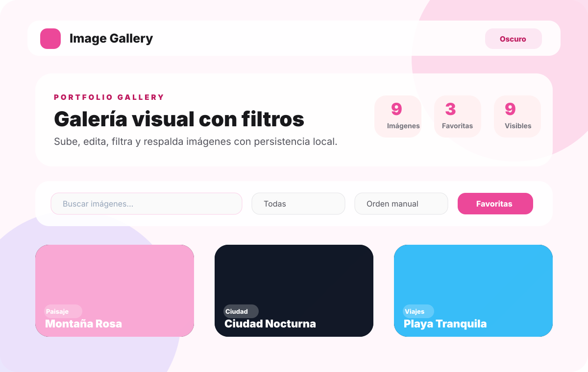
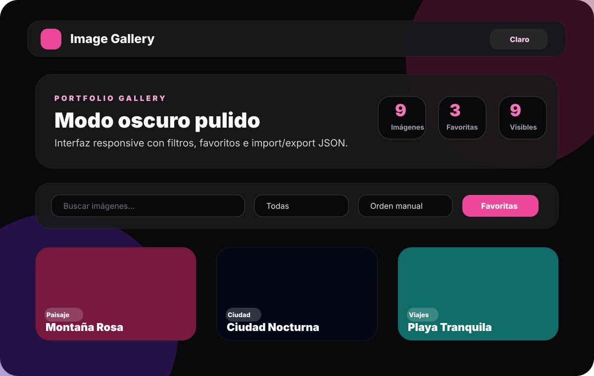
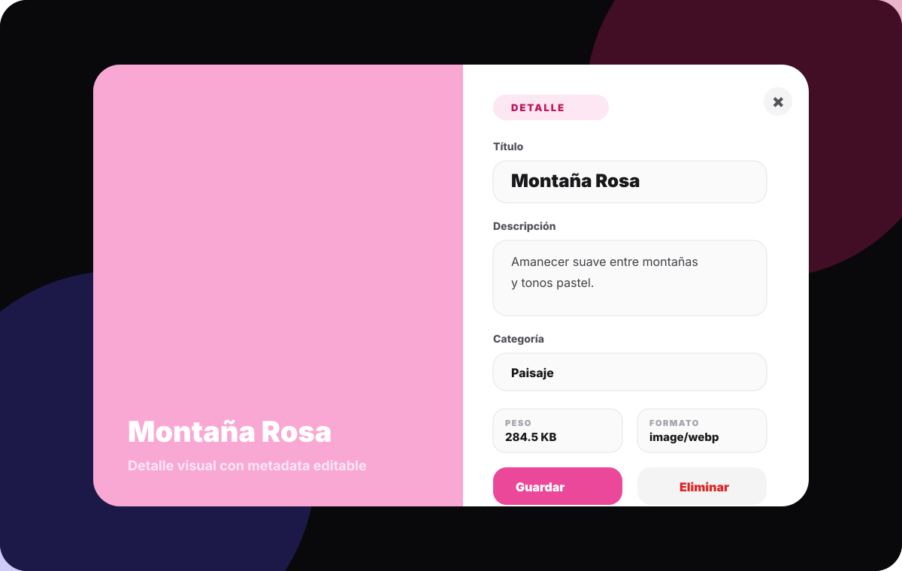

# Image Gallery App

Portfolio-ready image gallery built with **React 19**, **TypeScript**, **Vite**, **Tailwind CSS 4**, **Framer Motion**, drag and drop, and local browser persistence.

## Live Site

```text
https://noisgit.github.io/image-gallery-app/
```

## Preview







## Features

- Responsive visual gallery with polished cards and animated interactions.
- Upload images with file type and size validation.
- Compress uploaded images before storing them locally.
- Search by title, description, and category.
- Filter by category and favorite images.
- Sort by manual order, title, recent upload, or favorites.
- Edit title, description, and category in a detailed modal.
- Show image metadata such as file name, size, type, dimensions, date, and favorite state.
- Delete images with an undo action.
- Import and export gallery backups as JSON.
- Recover safely if localStorage contains invalid data.
- Persist light and dark mode.
- Run lint, tests and build checks with GitHub Actions.
- Deploy from `main` with GitHub Pages Actions.

## Tech Stack

- React
- TypeScript
- Vite
- Tailwind CSS
- Framer Motion
- @hello-pangea/dnd
- React Hot Toast
- GitHub Actions

## Git Flow

```text
main      -> production-ready branch
develop   -> integration branch
feature/* -> feature work branches
```

Recommended flow:

```text
feature/* -> develop -> main
```

## Deployment

GitHub Pages deploy is configured in `.github/workflows/deploy.yml` and runs on every push to `main`.

The app is built with the repository base path:

```bash
npm run build -- --base=/image-gallery-app/
```

If Pages is not enabled yet, set the repository Pages source to **GitHub Actions**.

## Local Development

```bash
npm install
npm run dev
npm run lint
npm test
npm run build
```

## Author

Developed by [NoisGit](https://github.com/NoisGit).
